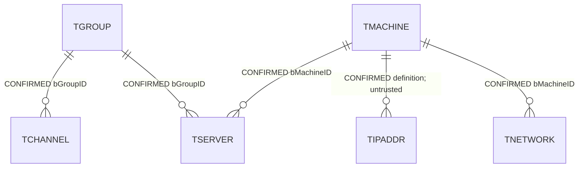
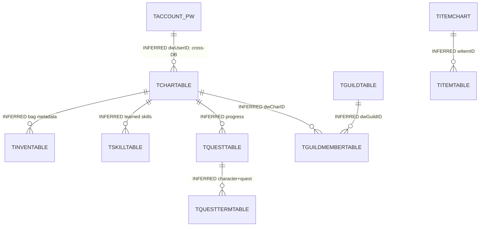

# 06 — Logical legacy reconstruction and provenance

**CONFIRMED** means restored original metadata or an original definition.
**INFERRED** means a relationship/behavior derived from source or data checks.
**PROPOSED** means a modern structure with no claim of legacy existence.
Table names alone never promote an inferred relationship to CONFIRMED.

Every known table's columns, schema, nullability, type widths/precision, defaults,
collation, PK membership and identity state are in
[backup-schema.json](evidence/backup-schema.json). Keys/index includes/direction,
FK flags and module hashes/parameters/dependencies are recorded there too.
Each database links to the immutable backup SHA-256 in backup-metadata and artifact
inventory. All 268 table definitions were generated in
[`database/legacy-reconstructed/`](../../../database/legacy-reconstructed/) and
executed on fresh SQL Server databases; their logical projections match all 2,405
columns after redundant default parentheses and historical column-ID gaps are
normalized. Those files reconstruct **tables/PKs**, not secondary indexes, FKs,
views, procedures, permissions or historical identity high-water counters.
They must not be described as a complete runnable legacy deployment.

Confirmed deployed global FK graph (TIPADDR edge is untrusted):

Gameplay relationships inferred from named SQL parameters/joins and source:

TITEMTABLE ownership is polymorphic (`bOwnerType,dwOwnerID`), and storage is a
separate tuple (`bStorageType,dwStorageID,bItemID`). A single unconditional character
FK would be wrong for guild/mail/other ownership. TINVENTABLE and item instances
must remain separate until the exact container/slot model is settled. `dlID` in
TITEMTABLE is **not identity**: the allocator is TDBITEMINDEXTABLE/TGenerateDBItemID.
Several tables including TSKILLTABLE have no declared PK; row duplicates must be
profiled before introducing a candidate unique key.

Reference checks are in [relationship-checks.json](evidence/relationship-checks.json).
Quest terms→quests has 0 unmatched rows; rewards→quests has 62; spawn mappings→
monster/spawn have 2/6; monster loot→monster has 2; skill data→skill has 0.
These are raw comparisons, not asserted mandatory FKs: sentinels, removed content
and fallback behavior must be reviewed. A naive same-ID monster-attribute join
produces 7,170 unmatched rows and is deliberately labelled UNVERIFIED. The legacy
source proves attribute-template lookup through wMonAttr instead; that contract
has 39 missing (attribute,level) combinations versus 3,468 for the portable lookup.

Completeness has separate, explainable dimensions
([completeness.json](evidence/completeness.json)):

| Dimension | Confirmed numerator/denominator and limit |
|---|---|
| Supplied schema | 268/268 tables, 2,405 columns, 353/353 readable modules; complete metadata within the two supplied backups |
| Relationships | All 5 declared FKs captured, 1 untrusted; 0 declared game FKs. Inferred graph incomplete and cannot be scored against an unknown ground truth |
| Static content | 93 known CHART tables, 81 nonempty across both DBs. Imported 14 of 81 game CHART tables plus TSKILLDATA; 106,692 selected rows value-verified. Other content remains in originals |
| Source persistence availability | 143 of 158 portable application object names have backup matches; exact behavior/signatures/ownership are not implied |
| Historical players | 0 character, item-instance and guild rows; one global account and no TACCOUNT_PW rows. Player progress cannot be fabricated from audit counts |
| Operational compatibility | Restores/CHECKDB passed; PostgreSQL game startup and legacy cross-DB procedure execution unverified/incomplete |

No single completion percentage is assigned. Backup schema completeness does not
prove game-content completeness, release matching, player recovery or current
server compatibility. Data gaps include external databases/services, modern
extensions, original client/patch pairing and the missing source relations above.

Full known-entity inventory follows. Counts are exact COUNT_BIG; CONFIRMED refers
to original structure/data availability, not a modern business interpretation.

| Original entity | Columns | Declared PK | Exact rows | Provenance |
|---|---:|---|---:|---|
| `TGLOBAL_RAGEZONE.dbo.IPBLACKLIST` | 1 | `none` | 0 | CONFIRMED |
| `TGLOBAL_RAGEZONE.dbo.IPBLACKLIST_game` | 1 | `none` | 0 | CONFIRMED |
| `TGLOBAL_RAGEZONE.dbo.TACCOUNT` | 6 | `dwUserID` | 1 | CONFIRMED |
| `TGLOBAL_RAGEZONE.dbo.TACCOUNT_PW` | 11 | `dwUserID` | 0 | CONFIRMED |
| `TGLOBAL_RAGEZONE.dbo.TALLCHARTABLE` | 30 | `dwSeq` | 0 | CONFIRMED |
| `TGLOBAL_RAGEZONE.dbo.TALLCHARTABLE_TRIGGER` | 3 | `none` | 0 | CONFIRMED |
| `TGLOBAL_RAGEZONE.dbo.TALLLOCALTABLE` | 9 | `dDate,bWorld,wLocalID` | 0 | CONFIRMED |
| `TGLOBAL_RAGEZONE.dbo.TALLRANKGUILDTABLE` | 15 | `none` | 0 | CONFIRMED |
| `TGLOBAL_RAGEZONE.dbo.TALLRANKTABLE` | 14 | `dDate,bWorld,bRankType,dwCharID` | 0 | CONFIRMED |
| `TGLOBAL_RAGEZONE.dbo.TCABINETITEMCHART` | 24 | `none` | 0 | CONFIRMED |
| `TGLOBAL_RAGEZONE.dbo.TCASHBONUSITEMCHART` | 3 | `wCashItemID,wBonusItem` | 427 | CONFIRMED |
| `TGLOBAL_RAGEZONE.dbo.TCASHCATEGORYCHART` | 3 | `bID` | 23 | CONFIRMED |
| `TGLOBAL_RAGEZONE.dbo.TCASHGAMBLECHART` | 32 | `dwID` | 520 | CONFIRMED |
| `TGLOBAL_RAGEZONE.dbo.TCASHITEMBUYTABLE` | 5 | `none` | 0 | CONFIRMED |
| `TGLOBAL_RAGEZONE.dbo.TCASHITEMCABINETTABLE` | 33 | `dwID` | 0 | CONFIRMED |
| `TGLOBAL_RAGEZONE.dbo.TCASHITEMCABINETTABLE_PW` | 31 | `dwID` | 0 | CONFIRMED |
| `TGLOBAL_RAGEZONE.dbo.TCASHITEMCABINETTABLE_temp` | 31 | `none` | 0 | CONFIRMED |
| `TGLOBAL_RAGEZONE.dbo.TCASHITEMINFOCHART` | 5 | `wCashItemID` | 14 | CONFIRMED |
| `TGLOBAL_RAGEZONE.dbo.TCASHITEMPRICETABLE` | 4 | `none` | 114 | CONFIRMED |
| `TGLOBAL_RAGEZONE.dbo.TCASHSHOPITEMCHART` | 42 | `wID` | 709 | CONFIRMED |
| `TGLOBAL_RAGEZONE.dbo.TCASHTESTTABLE` | 5 | `dwUserID` | 0 | CONFIRMED |
| `TGLOBAL_RAGEZONE.dbo.TCHANNEL` | 6 | `bChannel,bGroupID` | 4 | CONFIRMED |
| `TGLOBAL_RAGEZONE.dbo.TCURRENTUSER` | 13 | `dwKEY` | 0 | CONFIRMED |
| `TGLOBAL_RAGEZONE.dbo.TDURINGITEMTABLE` | 5 | `dwUserID,wItemID` | 0 | CONFIRMED |
| `TGLOBAL_RAGEZONE.dbo.TEMPUSERID` | 1 | `none` | 0 | CONFIRMED |
| `TGLOBAL_RAGEZONE.dbo.TEVENT042501TL` | 2 | `none` | 2,104 | CONFIRMED |
| `TGLOBAL_RAGEZONE.dbo.TEVENTCHART` | 17 | `dwIndex` | 0 | CONFIRMED |
| `TGLOBAL_RAGEZONE.dbo.TEVENTGIVEERROR` | 3 | `none` | 0 | CONFIRMED |
| `TGLOBAL_RAGEZONE.dbo.TEVENTHORSE` | 3 | `none` | 0 | CONFIRMED |
| `TGLOBAL_RAGEZONE.dbo.TGROUP` | 11 | `bGroupID` | 2 | CONFIRMED |
| `TGLOBAL_RAGEZONE.dbo.TIPADDR` | 4 | `bMachineID,szIPAddr` | 2 | CONFIRMED |
| `TGLOBAL_RAGEZONE.dbo.TIPAUTHORITY` | 2 | `szIP` | 0 | CONFIRMED |
| `TGLOBAL_RAGEZONE.dbo.TITEMCHART` | 44 | `none` | 2,519 | CONFIRMED |
| `TGLOBAL_RAGEZONE.dbo.TKEEPINGNAME` | 2 | `none` | 27 | CONFIRMED |
| `TGLOBAL_RAGEZONE.dbo.TLIMITEDLEVELCHART` | 2 | `none` | 1 | CONFIRMED |
| `TGLOBAL_RAGEZONE.dbo.TLOG` | 7 | `dwKEY` | 699,982 | CONFIRMED |
| `TGLOBAL_RAGEZONE.dbo.TLogTest` | 2 | `dwID` | 5 | CONFIRMED |
| `TGLOBAL_RAGEZONE.dbo.TMACHINE` | 3 | `bMachineID` | 3 | CONFIRMED |
| `TGLOBAL_RAGEZONE.dbo.TMANAGER` | 8 | `szID` | 1 | CONFIRMED |
| `TGLOBAL_RAGEZONE.dbo.TMANAGERLOG` | 6 | `dwSeq` | 0 | CONFIRMED |
| `TGLOBAL_RAGEZONE.dbo.TMONSTERCHART` | 32 | `none` | 1,811 | CONFIRMED |
| `TGLOBAL_RAGEZONE.dbo.TNETWORK` | 2 | `bMachineID` | 1 | CONFIRMED |
| `TGLOBAL_RAGEZONE.dbo.TPCBANGMASTERTABLE` | 6 | `dwPcBangID` | 0 | CONFIRMED |
| `TGLOBAL_RAGEZONE.dbo.TPCBANGPLAYTABLE` | 4 | `dwUserID,dwPlayDate` | 31 | CONFIRMED |
| `TGLOBAL_RAGEZONE.dbo.TPREVERSION` | 4 | `dwBetaVer` | 0 | CONFIRMED |
| `TGLOBAL_RAGEZONE.dbo.TREGIONCHART` | 15 | `dwID` | 326 | CONFIRMED |
| `TGLOBAL_RAGEZONE.dbo.TRESERVEDNAME` | 3 | `szName` | 29 | CONFIRMED |
| `TGLOBAL_RAGEZONE.dbo.TSECURECODE` | 5 | `none` | 0 | CONFIRMED |
| `TGLOBAL_RAGEZONE.dbo.TSERVER` | 6 | `none` | 13 | CONFIRMED |
| `TGLOBAL_RAGEZONE.dbo.TSMSTABLE` | 10 | `none` | 0 | CONFIRMED |
| `TGLOBAL_RAGEZONE.dbo.TSVRTYPE` | 3 | `bType` | 8 | CONFIRMED |
| `TGLOBAL_RAGEZONE.dbo.TTEMPCASHITEM` | 4 | `none` | 0 | CONFIRMED |
| `TGLOBAL_RAGEZONE.dbo.TTEMPDURINGITEMTABLE` | 5 | `dwUserID,wItemID` | 0 | CONFIRMED |
| `TGLOBAL_RAGEZONE.dbo.TTESTLOGINUSER` | 1 | `none` | 1 | CONFIRMED |
| `TGLOBAL_RAGEZONE.dbo.TUNIFYCASHITEM` | 3 | `none` | 0 | CONFIRMED |
| `TGLOBAL_RAGEZONE.dbo.TUNIFYPOSTITEMTABLE` | 23 | `dwUserID,dwPostID` | 0 | CONFIRMED |
| `TGLOBAL_RAGEZONE.dbo.TUSERATTENDTABLE` | 3 | `dwUserID,bDay` | 0 | CONFIRMED |
| `TGLOBAL_RAGEZONE.dbo.TUSERINFOTABLE` | 4 | `dwUserID` | 11,976 | CONFIRMED |
| `TGLOBAL_RAGEZONE.dbo.TUSERPROTECTED` | 14 | `dwSeq` | 0 | CONFIRMED |
| `TGLOBAL_RAGEZONE.dbo.TUSERPROTECTED_old` | 14 | `dwSeq` | 149 | CONFIRMED |
| `TGLOBAL_RAGEZONE.dbo.TUSER_INTERFACE` | 3 | `bOption` | 2 | CONFIRMED |
| `TGLOBAL_RAGEZONE.dbo.TVERSION` | 5 | `dwVersion` | 0 | CONFIRMED |
| `TGLOBAL_RAGEZONE.dbo.TVETERANCHART` | 2 | `bID` | 3 | CONFIRMED |
| `TGLOBAL_RAGEZONE.dbo.TempEvent` | 5 | `none` | 0 | CONFIRMED |
| `TGLOBAL_RAGEZONE.dbo.USERIPLOG` | 3 | `none` | 0 | CONFIRMED |
| `TGLOBAL_RAGEZONE.dbo.releaseDate` | 1 | `none` | 1 | CONFIRMED |
| `TGLOBAL_RAGEZONE.dbo.ttemplevel` | 2 | `none` | 0 | CONFIRMED |
| `TGLOBAL_RAGEZONE.dbo.ttempuser` | 4 | `none` | 0 | CONFIRMED |
| `TGAME_RAGEZONE.dbo.ACCESSORYMAGICTABLE` | 4 | `ID` | 0 | CONFIRMED |
| `TGAME_RAGEZONE.dbo.OTESTER` | 1 | `none` | 0 | CONFIRMED |
| `TGAME_RAGEZONE.dbo.STATISTICACCOUNT` | 1 | `none` | 10,317 | CONFIRMED |
| `TGAME_RAGEZONE.dbo.STATISTICTEMP` | 1 | `none` | 1,118 | CONFIRMED |
| `TGAME_RAGEZONE.dbo.TACTIVECHARTABLE` | 2 | `dwCharID` | 0 | CONFIRMED |
| `TGAME_RAGEZONE.dbo.TAICHART` | 6 | `bAIType,dwCmdID,bTriggerType,dwTriggerID` | 47 | CONFIRMED |
| `TGAME_RAGEZONE.dbo.TAICMDCHART` | 2 | `dwCmdID` | 18 | CONFIRMED |
| `TGAME_RAGEZONE.dbo.TAICONCHART` | 3 | `dwCmdID,bConditionType` | 6 | CONFIRMED |
| `TGAME_RAGEZONE.dbo.TAIDTABLE` | 3 | `dwCharID` | 0 | CONFIRMED |
| `TGAME_RAGEZONE.dbo.TARENACHART` | 5 | `wID` | 2 | CONFIRMED |
| `TGAME_RAGEZONE.dbo.TAUCTIONBIDDER` | 4 | `dwAuctionID,dwCharID` | 0 | CONFIRMED |
| `TGAME_RAGEZONE.dbo.TAUCTIONINTEREST` | 2 | `dwCharID,dwAuctionID` | 0 | CONFIRMED |
| `TGAME_RAGEZONE.dbo.TAUCTIONTABLE` | 9 | `dwAuctionID` | 0 | CONFIRMED |
| `TGAME_RAGEZONE.dbo.TBATTLERANKCHART` | 2 | `none` | 0 | CONFIRMED |
| `TGAME_RAGEZONE.dbo.TBATTLETIMECHART` | 8 | `bType` | 5 | CONFIRMED |
| `TGAME_RAGEZONE.dbo.TBATTLEZONECHART` | 24 | `wID` | 26 | CONFIRMED |
| `TGAME_RAGEZONE.dbo.TBOWBONUSITEMCHART` | 3 | `none` | 11 | CONFIRMED |
| `TGAME_RAGEZONE.dbo.TBOWITEMCHART` | 6 | `none` | 31 | CONFIRMED |
| `TGAME_RAGEZONE.dbo.TBOWITEMCHART1` | 6 | `none` | 1 | CONFIRMED |
| `TGAME_RAGEZONE.dbo.TBOWSETTINGSCHART` | 6 | `none` | 0 | CONFIRMED |
| `TGAME_RAGEZONE.dbo.TBRPLAYERTABLE` | 2 | `none` | 0 | CONFIRMED |
| `TGAME_RAGEZONE.dbo.TBRSETTINGSCHART` | 4 | `none` | 1 | CONFIRMED |
| `TGAME_RAGEZONE.dbo.TBRSPAWNPOSCHART` | 4 | `none` | 8 | CONFIRMED |
| `TGAME_RAGEZONE.dbo.TBRSUPPLIESCHART` | 3 | `none` | 1 | CONFIRMED |
| `TGAME_RAGEZONE.dbo.TCABINETITEMTABLE` | 25 | `dwCharID,bCabinetID,dwStItemID` | 0 | CONFIRMED |
| `TGAME_RAGEZONE.dbo.TCABINETTABLE` | 3 | `dwCharID,bCabinetID` | 0 | CONFIRMED |
| `TGAME_RAGEZONE.dbo.TCASTLEAPPLICANTTABLE` | 3 | `dwCharID` | 0 | CONFIRMED |
| `TGAME_RAGEZONE.dbo.TCASTLETABLE` | 6 | `none` | 4 | CONFIRMED |
| `TGAME_RAGEZONE.dbo.TCHANGEDITEM` | 2 | `none` | 960 | CONFIRMED |
| `TGAME_RAGEZONE.dbo.TCHANNELCHART` | 5 | `none` | 361 | CONFIRMED |
| `TGAME_RAGEZONE.dbo.TCHARTABLE` | 47 | `dwCharID` | 0 | CONFIRMED |
| `TGAME_RAGEZONE.dbo.TCLASSCHART` | 7 | `bClassID` | 6 | CONFIRMED |
| `TGAME_RAGEZONE.dbo.TCMGIFTCHART` | 11 | `wGiftID` | 16 | CONFIRMED |
| `TGAME_RAGEZONE.dbo.TCMGIFTTABLE` | 6 | `none` | 0 | CONFIRMED |
| `TGAME_RAGEZONE.dbo.TCOMPANIONBONUSCHART` | 3 | `none` | 12 | CONFIRMED |
| `TGAME_RAGEZONE.dbo.TCOMPANIONBONUSCHART_EMPTY` | 3 | `none` | 0 | CONFIRMED |
| `TGAME_RAGEZONE.dbo.TCOMPANIONITEMTABLE` | 7 | `none` | 11 | CONFIRMED |
| `TGAME_RAGEZONE.dbo.TCOMPANIONTABLE` | 16 | `none` | 0 | CONFIRMED |
| `TGAME_RAGEZONE.dbo.TCUSTOMCLOAKTABLE` | 3 | `none` | 11 | CONFIRMED |
| `TGAME_RAGEZONE.dbo.TCUSTOMTIMECHART` | 2 | `none` | 3 | CONFIRMED |
| `TGAME_RAGEZONE.dbo.TDBITEMINDEXTABLE` | 2 | `none` | 1 | CONFIRMED |
| `TGAME_RAGEZONE.dbo.TDESTINATIONCHART` | 10 | `wPortalID,wDestID` | 1,097 | CONFIRMED |
| `TGAME_RAGEZONE.dbo.TDUELCHARTABLE` | 7 | `none` | 0 | CONFIRMED |
| `TGAME_RAGEZONE.dbo.TDUELSCORETABLE` | 13 | `dwCharID` | 0 | CONFIRMED |
| `TGAME_RAGEZONE.dbo.TEQUIPCREATECHARCHART` | 12 | `bCountry,bClass,bSex` | 36 | CONFIRMED |
| `TGAME_RAGEZONE.dbo.TERASECHARLOG` | 3 | `none` | 0 | CONFIRMED |
| `TGAME_RAGEZONE.dbo.TERASEITEM` | 1 | `none` | 960 | CONFIRMED |
| `TGAME_RAGEZONE.dbo.TEST` | 1 | `none` | 28 | CONFIRMED |
| `TGAME_RAGEZONE.dbo.TEVENTITEMTABLE` | 2 | `dwCharID` | 0 | CONFIRMED |
| `TGAME_RAGEZONE.dbo.TEVENTQUARTERCHART` | 14 | `wID` | 0 | CONFIRMED |
| `TGAME_RAGEZONE.dbo.TEVENTQUARTERGIVETABLE` | 5 | `none` | 0 | CONFIRMED |
| `TGAME_RAGEZONE.dbo.TEXPITEMTABLE` | 5 | `none` | 0 | CONFIRMED |
| `TGAME_RAGEZONE.dbo.TFAKECHARCHART` | 3 | `dwCharID` | 0 | CONFIRMED |
| `TGAME_RAGEZONE.dbo.TFAKESHOPCHART` | 4 | `wIndex,bCountry` | 0 | CONFIRMED |
| `TGAME_RAGEZONE.dbo.TFORMULACHART` | 5 | `bID` | 34 | CONFIRMED |
| `TGAME_RAGEZONE.dbo.TFRIENDGROUPTABLE` | 3 | `dwCharID,bGroup` | 0 | CONFIRMED |
| `TGAME_RAGEZONE.dbo.TFRIENDTABLE` | 3 | `dwCharID,dwFriendID` | 0 | CONFIRMED |
| `TGAME_RAGEZONE.dbo.TGAMBLECHART` | 7 | `none` | 78 | CONFIRMED |
| `TGAME_RAGEZONE.dbo.TGATECHART` | 7 | `none` | 277 | CONFIRMED |
| `TGAME_RAGEZONE.dbo.TGEMGRADECHART` | 2 | `bGem` | 6 | CONFIRMED |
| `TGAME_RAGEZONE.dbo.TGMREWARDCHART` | 4 | `none` | 0 | CONFIRMED |
| `TGAME_RAGEZONE.dbo.TGMREWARDTABLE` | 4 | `dwUserID,bLevel` | 0 | CONFIRMED |
| `TGAME_RAGEZONE.dbo.TGODBALLCHART` | 6 | `wID` | 16 | CONFIRMED |
| `TGAME_RAGEZONE.dbo.TGODTOWERCHART` | 5 | `wID` | 16 | CONFIRMED |
| `TGAME_RAGEZONE.dbo.TGUILDARTICLETABLE` | 7 | `dwGuildID,dwID` | 0 | CONFIRMED |
| `TGAME_RAGEZONE.dbo.TGUILDCABINETTABLE` | 24 | `dwGuildID,dwItemID` | 0 | CONFIRMED |
| `TGAME_RAGEZONE.dbo.TGUILDCHART` | 15 | `bLevel` | 11 | CONFIRMED |
| `TGAME_RAGEZONE.dbo.TGUILDMEMBERSKILLTABLE` | 4 | `none` | 0 | CONFIRMED |
| `TGAME_RAGEZONE.dbo.TGUILDMEMBERTABLE` | 5 | `dwCharID` | 0 | CONFIRMED |
| `TGAME_RAGEZONE.dbo.TGUILDPLAYLOG` | 4 | `none` | 0 | CONFIRMED |
| `TGAME_RAGEZONE.dbo.TGUILDPVPOINTREWARDTABLE` | 4 | `none` | 0 | CONFIRMED |
| `TGAME_RAGEZONE.dbo.TGUILDPVPRECORDTABLE` | 13 | `none` | 0 | CONFIRMED |
| `TGAME_RAGEZONE.dbo.TGUILDRELATION` | 3 | `none` | 0 | CONFIRMED |
| `TGAME_RAGEZONE.dbo.TGUILDSKILLCHART` | 2 | `none` | 0 | CONFIRMED |
| `TGAME_RAGEZONE.dbo.TGUILDSTATSTABLE` | 4 | `none` | 1 | CONFIRMED |
| `TGAME_RAGEZONE.dbo.TGUILDTABLE` | 20 | `dwID` | 0 | CONFIRMED |
| `TGAME_RAGEZONE.dbo.TGUILDTABLE_copy` | 20 | `dwID` | 1 | CONFIRMED |
| `TGAME_RAGEZONE.dbo.TGUILDTACTICSTABLE` | 7 | `dwCharID,dwGuildID` | 0 | CONFIRMED |
| `TGAME_RAGEZONE.dbo.TGUILDTACTICSWANTEDTABLE` | 12 | `dwID` | 0 | CONFIRMED |
| `TGAME_RAGEZONE.dbo.TGUILDVOLUNTEERTABLE` | 3 | `dwCharID,bType` | 0 | CONFIRMED |
| `TGAME_RAGEZONE.dbo.TGUILDWANTEDTABLE` | 6 | `dwGuildID` | 0 | CONFIRMED |
| `TGAME_RAGEZONE.dbo.THELPMESSAGETABLE` | 4 | `bID` | 3 | CONFIRMED |
| `TGAME_RAGEZONE.dbo.THEROTABLE` | 22 | `none` | 0 | CONFIRMED |
| `TGAME_RAGEZONE.dbo.THOTKEYTABLE` | 26 | `none` | 0 | CONFIRMED |
| `TGAME_RAGEZONE.dbo.TINDUNCHART` | 4 | `wMapID` | 20 | CONFIRMED |
| `TGAME_RAGEZONE.dbo.TINVENTABLE` | 5 | `dwCharID,bInvenID` | 0 | CONFIRMED |
| `TGAME_RAGEZONE.dbo.TINVENTOURNAMENTCHART` | 3 | `none` | 0 | CONFIRMED |
| `TGAME_RAGEZONE.dbo.TITEMATTRCHART` | 10 | `wID` | 9,002 | CONFIRMED |
| `TGAME_RAGEZONE.dbo.TITEMCHANGE` | 30 | `none` | 0 | CONFIRMED |
| `TGAME_RAGEZONE.dbo.TITEMCHART` | 52 | `wItemID` | 7,706 | CONFIRMED |
| `TGAME_RAGEZONE.dbo.TITEMCHART_bak` | 52 | `wItemID` | 5,957 | CONFIRMED |
| `TGAME_RAGEZONE.dbo.TITEMGRADECHART` | 4 | `none` | 25 | CONFIRMED |
| `TGAME_RAGEZONE.dbo.TITEMLEVELCHART` | 2 | `bGrade` | 125 | CONFIRMED |
| `TGAME_RAGEZONE.dbo.TITEMLOG` | 31 | `none` | 0 | CONFIRMED |
| `TGAME_RAGEZONE.dbo.TITEMMAGICCHART` | 13 | `bMagic` | 27 | CONFIRMED |
| `TGAME_RAGEZONE.dbo.TITEMMAGICLEVELCHART` | 2 | `dwSection` | 71 | CONFIRMED |
| `TGAME_RAGEZONE.dbo.TITEMMAGICSKILLCHART` | 6 | `none` | 4 | CONFIRMED |
| `TGAME_RAGEZONE.dbo.TITEMSETCHART` | 21 | `wBaseID,wSetID` | 393 | CONFIRMED |
| `TGAME_RAGEZONE.dbo.TITEMTABLE` | 35 | `dlID` | 0 | CONFIRMED |
| `TGAME_RAGEZONE.dbo.TITEMTOURNAMENTCHART` | 29 | `none` | 0 | CONFIRMED |
| `TGAME_RAGEZONE.dbo.TITEMUSEDTABLE` | 3 | `dwCharID,wDelayGroupID` | 0 | CONFIRMED |
| `TGAME_RAGEZONE.dbo.TLASTCOMPANIONTABLE` | 2 | `none` | 16 | CONFIRMED |
| `TGAME_RAGEZONE.dbo.TLEVELCHART` | 16 | `bLevel` | 126 | CONFIRMED |
| `TGAME_RAGEZONE.dbo.TLOCALOCCUPYTABLE` | 4 | `wLocalID,bDay` | 72 | CONFIRMED |
| `TGAME_RAGEZONE.dbo.TLOCALTABLE` | 7 | `wLocalID` | 12 | CONFIRMED |
| `TGAME_RAGEZONE.dbo.TMAPCHART` | 4 | `bGroupID,wMapID,bServerID` | 301 | CONFIRMED |
| `TGAME_RAGEZONE.dbo.TMAPMONCHART` | 5 | `wSpawnID,wMonID,bEssential` | 23,381 | CONFIRMED |
| `TGAME_RAGEZONE.dbo.TMEDALS` | 2 | `none` | 17 | CONFIRMED |
| `TGAME_RAGEZONE.dbo.TMENTORTABLE` | 3 | `dwCharID` | 0 | CONFIRMED |
| `TGAME_RAGEZONE.dbo.TMISSIONTABLE` | 2 | `none` | 8 | CONFIRMED |
| `TGAME_RAGEZONE.dbo.TMONATTRCHART` | 21 | `wID,bLevel` | 9,290 | CONFIRMED |
| `TGAME_RAGEZONE.dbo.TMONITEMCHART` | 17 | `wMonID,wItemID,bChartType` | 16,466 | CONFIRMED |
| `TGAME_RAGEZONE.dbo.TMONSPAWNCHART` | 19 | `wID` | 20,357 | CONFIRMED |
| `TGAME_RAGEZONE.dbo.TMONSTERCHART` | 33 | `wID` | 3,534 | CONFIRMED |
| `TGAME_RAGEZONE.dbo.TMONSTERSHOPCHART` | 5 | `wID` | 128 | CONFIRMED |
| `TGAME_RAGEZONE.dbo.TMONTHPVPOINTTABLE` | 6 | `dwCharID,bCountry` | 0 | CONFIRMED |
| `TGAME_RAGEZONE.dbo.TMONTHRANKCHART` | 13 | `bRank` | 9 | CONFIRMED |
| `TGAME_RAGEZONE.dbo.TMONTHRANKTABLE` | 21 | `none` | 0 | CONFIRMED |
| `TGAME_RAGEZONE.dbo.TMOUNTCHART` | 3 | `wMountID` | 40 | CONFIRMED |
| `TGAME_RAGEZONE.dbo.TMOUNTITEMTABLE` | 4 | `dwUserID,wItemID` | 0 | CONFIRMED |
| `TGAME_RAGEZONE.dbo.TMOUNTTABLE` | 4 | `dwCharID,wMountID` | 0 | CONFIRMED |
| `TGAME_RAGEZONE.dbo.TNPCCHART` | 16 | `wID` | 2,623 | CONFIRMED |
| `TGAME_RAGEZONE.dbo.TNPCITEMCHART` | 2 | `wNpcID,dwItemID` | 3,364 | CONFIRMED |
| `TGAME_RAGEZONE.dbo.TOPERATORTABLE` | 1 | `dwOperatorID` | 0 | CONFIRMED |
| `TGAME_RAGEZONE.dbo.TPETCHART` | 10 | `wID` | 156 | CONFIRMED |
| `TGAME_RAGEZONE.dbo.TPETTABLE` | 5 | `dwUserID,wPetID` | 0 | CONFIRMED |
| `TGAME_RAGEZONE.dbo.TPLAYTIMETABLE` | 2 | `none` | 0 | CONFIRMED |
| `TGAME_RAGEZONE.dbo.TPORTALCHART` | 5 | `wPortalID` | 529 | CONFIRMED |
| `TGAME_RAGEZONE.dbo.TPOSTERRORTABLE` | 2 | `none` | 0 | CONFIRMED |
| `TGAME_RAGEZONE.dbo.TPOSTITEMTABLE` | 24 | `none` | 0 | CONFIRMED |
| `TGAME_RAGEZONE.dbo.TPOSTTABLE` | 14 | `dwPostID` | 0 | CONFIRMED |
| `TGAME_RAGEZONE.dbo.TPREMIUMSKILLCHART` | 3 | `none` | 0 | CONFIRMED |
| `TGAME_RAGEZONE.dbo.TPROTECTEDTABLE` | 4 | `dwCharID,dwProtected` | 0 | CONFIRMED |
| `TGAME_RAGEZONE.dbo.TPVPOINTCHART` | 6 | `none` | 66 | CONFIRMED |
| `TGAME_RAGEZONE.dbo.TPVPOINTTABLE` | 3 | `dwCharID` | 0 | CONFIRMED |
| `TGAME_RAGEZONE.dbo.TPVPRECENTTABLE` | 7 | `none` | 0 | CONFIRMED |
| `TGAME_RAGEZONE.dbo.TPVPRECORDTABLE` | 13 | `dwCharID` | 0 | CONFIRMED |
| `TGAME_RAGEZONE.dbo.TQCLASSCHART` | 3 | `dwClassID` | 336 | CONFIRMED |
| `TGAME_RAGEZONE.dbo.TQCONDITIONCHART` | 5 | `dwID` | 5,712 | CONFIRMED |
| `TGAME_RAGEZONE.dbo.TQREWARDCHART` | 12 | `dwID` | 4,322 | CONFIRMED |
| `TGAME_RAGEZONE.dbo.TQTITLECHART` | 10 | `dwQuestID` | 6,248 | CONFIRMED |
| `TGAME_RAGEZONE.dbo.TQUESTCHART` | 10 | `dwQuestID` | 6,261 | CONFIRMED |
| `TGAME_RAGEZONE.dbo.TQUESTITEMCHART` | 30 | `dwID` | 715 | CONFIRMED |
| `TGAME_RAGEZONE.dbo.TQUESTTABLE` | 5 | `dwCharID,dwQuestID` | 0 | CONFIRMED |
| `TGAME_RAGEZONE.dbo.TQUESTTERMCHART` | 5 | `dwID` | 10,687 | CONFIRMED |
| `TGAME_RAGEZONE.dbo.TQUESTTERMTABLE` | 5 | `dwCharID,dwQuestID,dwTermID` | 0 | CONFIRMED |
| `TGAME_RAGEZONE.dbo.TRACECHART` | 7 | `bRaceID` | 88 | CONFIRMED |
| `TGAME_RAGEZONE.dbo.TRANKING` | 2 | `dwCharID` | 4 | CONFIRMED |
| `TGAME_RAGEZONE.dbo.TRECALLMAINTAINTABLE` | 10 | `none` | 0 | CONFIRMED |
| `TGAME_RAGEZONE.dbo.TRECALLMONTABLE` | 14 | `dwID` | 0 | CONFIRMED |
| `TGAME_RAGEZONE.dbo.TRESERVEDPOST` | 35 | `dwSeq` | 0 | CONFIRMED |
| `TGAME_RAGEZONE.dbo.TRPSGAMECHART` | 13 | `bType,bWinCount` | 48 | CONFIRMED |
| `TGAME_RAGEZONE.dbo.TRPSGAMERECORDTABLE` | 4 | `none` | 0 | CONFIRMED |
| `TGAME_RAGEZONE.dbo.TSAVEDCUSTOMCLOAKTABLE` | 1 | `none` | 2 | CONFIRMED |
| `TGAME_RAGEZONE.dbo.TSKILLCHART` | 58 | `wID` | 765 | CONFIRMED |
| `TGAME_RAGEZONE.dbo.TSKILLDATA` | 9 | `wSkillID,bAction,bType,bAttr,bExec` | 1,172 | CONFIRMED |
| `TGAME_RAGEZONE.dbo.TSKILLLOG` | 7 | `none` | 0 | CONFIRMED |
| `TGAME_RAGEZONE.dbo.TSKILLMAINTAINTABLE` | 12 | `dwCharID,wSkillID` | 0 | CONFIRMED |
| `TGAME_RAGEZONE.dbo.TSKILLPOINTCHART` | 6 | `wID,bLevel` | 719 | CONFIRMED |
| `TGAME_RAGEZONE.dbo.TSKILLREWARD` | 3 | `wID,bLevel` | 1,134 | CONFIRMED |
| `TGAME_RAGEZONE.dbo.TSKILLREWARDMONEY` | 2 | `none` | 0 | CONFIRMED |
| `TGAME_RAGEZONE.dbo.TSKILLTABLE` | 4 | `none` | 0 | CONFIRMED |
| `TGAME_RAGEZONE.dbo.TSKYGARDENTABLE` | 3 | `wID` | 1 | CONFIRMED |
| `TGAME_RAGEZONE.dbo.TSOULMATETABLE` | 3 | `dwCharID` | 0 | CONFIRMED |
| `TGAME_RAGEZONE.dbo.TSPAWNPATHCHART` | 7 | `wSpawnID,bPathID` | 668 | CONFIRMED |
| `TGAME_RAGEZONE.dbo.TSPAWNPOSCHART` | 6 | `wID` | 417 | CONFIRMED |
| `TGAME_RAGEZONE.dbo.TSPECIALBOXCHART` | 32 | `none` | 5 | CONFIRMED |
| `TGAME_RAGEZONE.dbo.TSTARTHOTKEY` | 26 | `none` | 12 | CONFIRMED |
| `TGAME_RAGEZONE.dbo.TSTARTITEMCHART` | 7 | `bCountry,bClass,bInven,bSlot` | 189 | CONFIRMED |
| `TGAME_RAGEZONE.dbo.TSTARTRECALL` | 3 | `none` | 3 | CONFIRMED |
| `TGAME_RAGEZONE.dbo.TSTARTSKILL` | 3 | `none` | 237 | CONFIRMED |
| `TGAME_RAGEZONE.dbo.TSVRMSGCHART` | 2 | `dwID` | 51 | CONFIRMED |
| `TGAME_RAGEZONE.dbo.TSWITCHCHART` | 9 | `dwSwitchID` | 399 | CONFIRMED |
| `TGAME_RAGEZONE.dbo.TTAXTABLE` | 3 | `none` | 8 | CONFIRMED |
| `TGAME_RAGEZONE.dbo.TTEMPCABINETITEMTABLE` | 25 | `dwCharID,bCabinetID,dwStItemID` | 0 | CONFIRMED |
| `TGAME_RAGEZONE.dbo.TTEMPCABINETTABLE` | 3 | `dwCharID,bCabinetID` | 0 | CONFIRMED |
| `TGAME_RAGEZONE.dbo.TTEMPEXPITEMTABLE` | 5 | `none` | 0 | CONFIRMED |
| `TGAME_RAGEZONE.dbo.TTEMPINVENTABLE` | 5 | `dwCharID,bInvenID` | 0 | CONFIRMED |
| `TGAME_RAGEZONE.dbo.TTEMPITEMTABLE` | 35 | `none` | 0 | CONFIRMED |
| `TGAME_RAGEZONE.dbo.TTEMPITEMUSEDTABLE` | 3 | `dwCharID,wDelayGroupID` | 0 | CONFIRMED |
| `TGAME_RAGEZONE.dbo.TTEMPSKILLMAINTAINTABLE` | 12 | `dwCharID,wSkillID` | 0 | CONFIRMED |
| `TGAME_RAGEZONE.dbo.TTEMPSKILLTABLE` | 4 | `dwCharID,wSkillID` | 0 | CONFIRMED |
| `TGAME_RAGEZONE.dbo.TTITLECHART` | 5 | `wTitleID` | 111 | CONFIRMED |
| `TGAME_RAGEZONE.dbo.TTITLETABLE` | 3 | `dwCharID,wTitleID` | 88,538 | CONFIRMED |
| `TGAME_RAGEZONE.dbo.TTNMTEVENTREWARDTABLE` | 8 | `wID` | 0 | CONFIRMED |
| `TGAME_RAGEZONE.dbo.TTNMTEVENTSCHEDULETABLE` | 3 | `wTournamentID,bStep` | 78 | CONFIRMED |
| `TGAME_RAGEZONE.dbo.TTNMTEVENTTABLE` | 11 | `wTournamentID,bEntryID` | 0 | CONFIRMED |
| `TGAME_RAGEZONE.dbo.TTNMTEVENTTIMETABLE` | 4 | `wTournamentID` | 6 | CONFIRMED |
| `TGAME_RAGEZONE.dbo.TTOURNAMENTCHART` | 10 | `bEntryID` | 8 | CONFIRMED |
| `TGAME_RAGEZONE.dbo.TTOURNAMENTPLAYERTABLE` | 7 | `dwCharID` | 0 | CONFIRMED |
| `TGAME_RAGEZONE.dbo.TTOURNAMENTREWARDCHART` | 7 | `wID` | 32 | CONFIRMED |
| `TGAME_RAGEZONE.dbo.TTOURNAMENTREWARDCHART_weap` | 7 | `wID` | 32 | CONFIRMED |
| `TGAME_RAGEZONE.dbo.TTOURNAMENTSCHEDULECHART` | 4 | `bStep,bGroup` | 33 | CONFIRMED |
| `TGAME_RAGEZONE.dbo.TTOURNAMENTSTATUSTABLE` | 3 | `none` | 0 | CONFIRMED |
| `TGAME_RAGEZONE.dbo.TUNIFYPET` | 3 | `dwUserID,wPetID` | 0 | CONFIRMED |
| `TGAME_RAGEZONE.dbo.TUNITCHART` | 4 | `bGroup,bServerID,wMapID,wUnitID` | 361 | CONFIRMED |
| `TGAME_RAGEZONE.dbo.charkilling_log` | 3 | `none` | 0 | CONFIRMED |
| `TGAME_RAGEZONE.dbo.dtproperties` | 7 | `id,property` | 7 | CONFIRMED |
| `TGAME_RAGEZONE.tgame.TLASTMONTHPOINTTABLE` | 5 | `dwCharID` | 200 | CONFIRMED |
| `TGAME_RAGEZONE.tgame.TLASTTOTALPOINTTABLE` | 5 | `dwCharID` | 200 | CONFIRMED |
