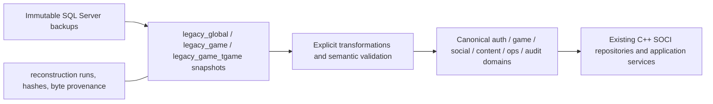

# 07 — PostgreSQL target architecture

The target keeps three distinct layers in one logical PostgreSQL database:

**Implemented:** reconstruction control plane, all 268 typed snapshot tables,
exact text-byte sidecars, content.releases and content.item_templates. Only the
item projection is implemented in the canonical layer. Auth/game/social/ops/audit
below are **PROPOSED specifications**, not already-created functional schemas.
Snapshot tables retain original names and values; `_import_run_id` and
`_source_row_number` preserve provenance and duplicate rows in keyless tables.
Original PKs become per-run unique constraints. Original FKs, business defaults,
identities and non-PK unique/index semantics are preserved as evidence, not blindly
applied to incomplete staging subsets. Stage columns map one-for-one via mapping.json.

| Proposed domain | Ownership and invariant | Source evidence / access pattern |
|---|---|---|
| auth.accounts / credentials / sessions | Login owns account policy; stable protocol user ID; credential scheme explicit; at most one active session claim per account | soci_auth_service, TCURRENTUSER; unique claim + transactional insert; rebuild transient sessions at cutover |
| game.characters / progress / positions | Login owns create/delete, Map owns saves; stable char ID; one active char per account slot and approved name equivalence; save version for optimistic concurrency | soci_char_service, soci_player_service, TCHARTABLE; character-scoped transactions |
| game.item_instances / locations / inventories | Stable dlID, one owner/location, transactional transfers; container slot uniqueness after sentinel rules; retain six legacy attribute/time slots initially | TITEMTABLE, TINVENTABLE, TSaveItem*; owner/storage-filtered access |
| game.skills / quest_progress / quest_terms | Character FK; candidate char+skill/quest/term keys gated on duplicates and term-type semantics | queries.h, TSKILLTABLE/TQUEST*; character-scoped batch load/save |
| social.guilds / members / friends / mail | Guild/member/character FKs, one applicable membership, directional friend edge; mail currency/item ownership atomic | guild_entities, friend_entities, TPOST*/TAUCTION*; ID/guild/recipient filters |
| content catalogs | Immutable release IDs, approved active release per realm, boot cache; no per-hit SQL lookup | Soci*Chart and spawn_manager; content.releases/item_templates are implemented subset |
| ops / audit | Registry, auth and history isolated from gameplay privileges; retention based on measured volume | peer registry/metrics, TLOG_AUDIT, TOP_AUDIT_LOG; append batches and time-range reads |

Use one PG database with schemas so former global/game writes can share one
SOCI transaction. Splitting databases before a demonstrated requirement would
recreate distributed transaction problems. Keep migration/DDL credentials separate
from runtime roles; application roles must not update historical snapshots.
The verified disposable database used an administrative role only. Production
GRANT/role provisioning is a pending deployment contract, not tested here.

| Observed source type/semantics | Snapshot mapping | Canonical policy |
|---|---|---|
| tinyint (BYTE) | smallint, CHECK 0..255 | Boolean only for a proven 0/1 field; otherwise byte enum/flag |
| smallint | signed smallint | WORD fields widen to integer 0..65535 when protocol evidence proves reinterpretation; handle -1 sentinels explicitly |
| int | signed integer | DWORD fields may widen to bigint 0..4294967295; signed source bits are not automatically a negative balance/error |
| bigint | bigint | Preserve dlID and world allocation ranges; do not replace wire IDs with UUIDs or invent unsigned overflow rules |
| real / float(p) | real / real if p<=24 else double precision | Preserve numeric representation; currency units/decimal scaling require domain proof |
| varchar/char/text | decoded text + exact original source bytes | Preserve source collation/code page metadata; approve normalization/case/trailing-space equivalence before unique indexes |
| nvarchar/nchar | Unicode text + exact UTF-16 source bytes | UTF-8 PG text; validate surrogates/length; do not assume names are ASCII |
| smalldatetime/datetime | timestamp without time zone | Keep original precision/naive time until source timezone is known; new ops timestamps timestamptz/UTC |
| image/binary/varbinary | bytea | Preserve raw bytes; versioned codecs before interpreting serialized fields |
| numeric/decimal | numeric(p,s) generator support | No such type in these backups; not claimed tested with real source rows |

Both database collations have code page **1252**. That does not prove historical
strings were correctly encoded; Korean-origin code/content cannot establish CP949
for every varchar field. Exact source-byte preservation plus Unicode value hashes
allow later diagnosis without destructive mojibake repair. A PG `text` column's
byte length and collation do not reproduce SQL Server varchar limits or
case/accent/trailing-space uniqueness automatically. No citext/ICU locale is
selected without a corpus comparison and login/name protocol policy.

Real exceptions: TSKILLCHART.wMapID=-1; dwDuration contains signed values whose
uint32 reinterpretation must follow source DWORD use. NPC fPosZ has a value about
-9.4e26: preserve it in reconstruction and flag/quarantine for publication rather
than silently clamping. All signed columns are preserved unchanged in staging.
The implemented item projection alone reinterprets wItemID as uint16 (legacy
DBAccess.h WORD and portable Narrow16), verified including -1→65535 synthetically.

Identity values are imported explicitly. Future canonical generators must resume
above both the source identity high-water counter and actual max imported ID,
respecting step/world ranges, rather than merely restarting at 1 or using max of
remaining rows after deletions. TITEMTABLE uses a separate world counter, not
identity. PG identity/sequence allocation is not gapless or rollback-able
([official sequence documentation](https://www.postgresql.org/docs/18/functions-sequence.html)).
Numeric protocol IDs remain stable; UUID is not needed here. JSONB is used only
for the small import manifest/control metadata, not flattened character/item rows.
Legacy attribute slots remain columns until their domain and query patterns justify
a child table; separate release/item keys in the canonical projection support an
immutable boot catalog without scanning all snapshots.

Authentication compatibility: `Client/TClient/TClientWnd.cpp` and modern
`soci_auth_service.cpp:49` document SHA1-hex on the wire and BCrypt over that value.
Existing modern code rejects non-BCrypt rows. **Hashing a stored SHA1-hex with
BCrypt can wrap the existing wire secret; it does not recover the plaintext or
create a plaintext-based modern hash.** Never apply that to arbitrary MD5/plaintext
rows without the client contract. Current backup TACCOUNT_PW has 0 rows, so no
populated auth migration has been verified. Retain a credential-scheme field in
the proposed model; preserve recognized compatible hashes, reset unknown schemes,
or rehash on successful verified login using the actual submitted secret. A future
plaintext/Argon2 path needs a client/auth protocol change. Existing bcrypt_migrate
was inspected, not executed; its generic wrapping cannot certify unknown inputs.

Expected MMORPG workload strategy (architectural expectations, **no benchmarks**):

- Cache immutable charts at boot/release change. Keep AI/combat ticks and monster
  instances in memory; persist only durable outcomes at bounded save boundaries.
- Add owner/storage indexes for items, character indexes for skills/quests,
  account+slot and approved active-name uniqueness for characters, guild ID for
  membership, and recipient/status/date for mail after real EXPLAIN/workload checks.
- Lock stable item/character/auction IDs in a consistent order during transfers;
  include currency and ownership in one transaction. Retry detected deadlock or
  serialization failures with bounded policy and idempotent operation keys.
  [PostgreSQL row locks](https://www.postgresql.org/docs/18/explicit-locking.html)
  provide the mechanism, not the application invariant by themselves.
- Replace shared item counter hot spots with a reviewed range-aware allocator.
  Retain save versions to reject stale concurrent character writes. Avoid N+1
  guild/member loads; current ORM already performs batched rowset reads.
- Partition audit history only after retention/volume measurements justify it;
  699,982 historical TLOG rows establish data volume, not throughput or a mandatory
  partitioning scheme. Never claim scaling figures from this forensic test.
