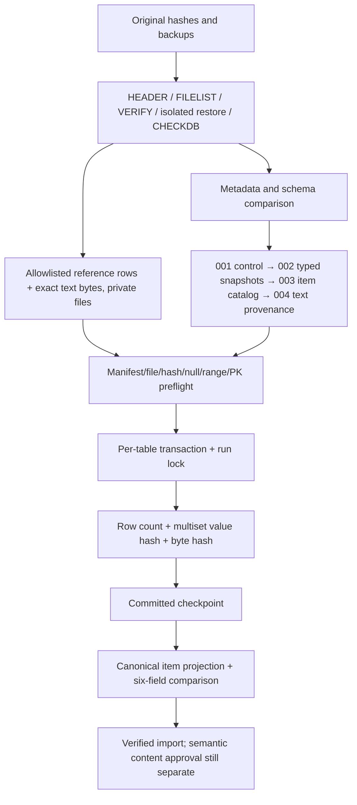

# 08 — Reproduction, migration and verification pipeline

Execution order is controlled by checksummed numbered migrations, **not historical
fragment filenames**. Never execute the old development fixtures on an existing
database: they contain DROP/CASCADE and incompatible subsets. Use a new disposable
instance for investigation; use reviewed production roles/backup policy for a
later deployment. Current game code remains unchanged.



Reproduction from repository root (Python 3, rootless Podman, Linux containers;
SQL Server 2022 Developer and PostgreSQL 18 images). Dependencies are limited to
the standalone migration tool; the server remains C++/SOCI.

```sh
DB_WORK=/tmp/4story-database-lab
python3 -m venv /tmp/4story-database-tools
/tmp/4story-database-tools/bin/pip install -r tools/database/requirements.txt
python3 tools/database/disposable_environment.py start --work "$DB_WORK"
SQL_CONTAINER="$(python3 -c 'import json,sys; print(json.load(open(sys.argv[1]))["mssql_container"])' "$DB_WORK/state.json")"
python3 tools/database/inspect_backup.py --container "$SQL_CONTAINER"   --private-output "$DB_WORK/inspection" --restore-disposable
python3 tools/database/forensics.py --private-backup-metadata "$DB_WORK/inspection"
python3 tools/database/profile_data.py --container "$SQL_CONTAINER"   --private-metadata "$DB_WORK/inspection"   --output _rewrite/docs/database-reconstruction/evidence/data-profiles.json
python3 tools/database/generate_migrations.py
python3 tools/database/extract_reference.py --container "$SQL_CONTAINER"   --output "$DB_WORK/reference-snapshot"
python3 tools/database/disposable_environment.py run-pg --work "$DB_WORK" --   /tmp/4story-database-tools/bin/python3 tools/database/migrate.py schema
python3 tools/database/disposable_environment.py run-pg --work "$DB_WORK" --   /tmp/4story-database-tools/bin/python3 tools/database/migrate.py import-reference   --manifest "$DB_WORK/reference-snapshot/manifest.json"
python3 tools/database/disposable_environment.py stop --work "$DB_WORK"
```

Choose a fresh nonexisting work directory. start waits for database readiness,
creates only labelled UUID-named containers/network, uses random passwords in
mode-0600 env files and publishes PG only on a random localhost port. run-pg
injects PG* variables without printing them. stop verifies ownership labels and
removes only those resources; private evidence files remain for the operator.
No host SQL service or game startup is involved. The initial manual inspection
environment was likewise isolated, with fixed forensic container names; later
the reusable labelled helper was independently verified.

inspect_backup refuses nonempty instances except the two fixed forensic databases
under explicit --resume-disposable. It never replaces them. Metadata/full original
modules remain private in a mode-0700 directory; the public forensic generator
publishes schema, hashes, dependencies and aggregate counts only.

generate_migrations derives 001–003 and mapping.json from public metadata; 004 is
a reviewed hand-written migration. Regenerate/review **before first application**.
After application, create a new numbered migration rather than editing old SQL.
The runner uses a migration advisory lock, transactional DDL and a checksum ledger;
an altered previously applied file is rejected. `schema` is safe to repeat.

extract_reference verifies the container backup hashes against the pinned source
inventory. It exports only **15 explicit gameplay catalog tables**; source rows,
raw text bytes and manifests stay outside the repository with restrictive modes.
It rejects an existing snapshot manifest and writes new snapshots, never overwrites
originals. `float/real` use SQL Server CONVERT style 3 on the restored modern engine
to retain distinct numeric values ([Microsoft conversion reference](https://learn.microsoft.com/en-us/sql/t-sql/functions/cast-and-convert-transact-sql?view=sql-server-ver17)).
Snapshots were read from isolated restored copies with no game or concurrent writer.
Live-source extraction would additionally need a coordinated snapshot/isolation
contract; this utility does not claim CDC/live-online migration support.

The importer validates metadata fingerprint, table allowlist, path containment,
file hashes, column sets, row counts, nullability, signed ranges and duplicate PKs.
Byte sidecars must exactly cover textual columns and row positions. Each table is
loaded in one transaction; hashes/counts and its checkpoint commit together. Data
is not overwritten across imports: a manifest identifies a run, and provenance
keys separate different snapshots. Original keyless duplicates are retained.
Per-table load order currently follows deterministic metadata order: the selected
snapshot tables have no mandatory cross-table FK; canonical release is created
before item rows. For future dependent canonical domains, load auth→characters→
containers/items→skills/quests→guild/social→mail/auction and validate each FK edge.

Re-running a manifest re-reads and checks checkpointed target rows/bytes, skipping
only verified matches. Drift is rejected, not repaired silently. A failure rolls
back the current table and records only table/SQLSTATE/error code in a separate
transaction; previous checkpoints remain recoverable. Source preflight failures
can report a row ordinal without data values. Driver-level batch failures may not
identify the failing row; row payloads/credentials are never logged. The current
reader buffers a catalog table in memory; chunked checkpoints/streaming are a P2
task for very large or sensitive datasets, not claimed implemented.

Row verification uses an order-independent multiset hash (duplicates and NULLs
preserved); real/double use IEEE float bits, timestamps retain microsecond values,
and binary/text data has independent byte preservation. JSONB journals contain
manifest/provenance, not source rows. The canonical item projection compares all
6 projected values including item identity, plus row count; all other source columns remain in
the typed snapshot. No missing rows, currencies, accounts or client data are seeded.

Before any player migration: establish credential/client contracts; select an
approved timezone/collation policy; classify sentinels; reconcile account/global
character indexes; resolve item/world ID allocation; scan duplicates/orphans;
implement explicit persistence adapters and test transactions/concurrency. Preserve
source keys and restart generators above historical high water. Do not import
TCURRENTUSER as active sessions. Import audit/private data only through a separately
approved restricted pipeline; this reference importer intentionally rejects it.
